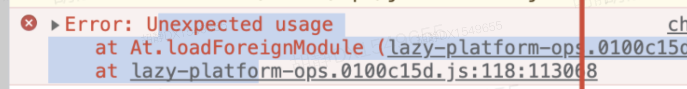
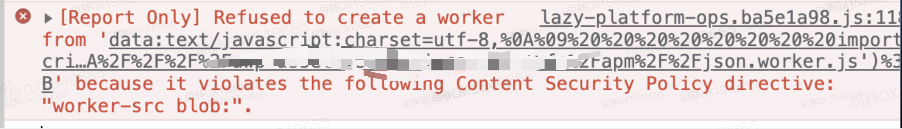

## monaco-editor 坑点
### 1. 发布环境报错“Error: Unexpected usage”
1）问题描述<br>
本地环境调试没有问题，但发布至发布环境会报错 *Error: Unexpected usage*



<div style="margin-bottom: 50px"></div>

2）原因分析<br>
`Worker`(编辑器启用) 线程无法读取本地文件，即不能打开本机的文件系统（*file://*），它所加载的脚本，必须来自网络（本地环境调用的是本地服务链接到的文件）。而在发布环境一直尝试读取本地环境文件导致报错<br>
*知识点：`Web Worker` 的作用，就是为 `JavaScript` 创造多线程环境，允许主线程创建 `Worker` 线程，将一些任务分配给后者运行。在主线程运行的同时，`Worker` 线程在后台运行，两者互不干扰。等到 `Worker` 线程完成计算任务，再把结果返回给主线程，详细[Web Worker](https://www.ruanyifeng.com/blog/2018/07/web-worker.html)
<div style="margin-bottom: 50px"></div>

3）解决方案<br>
- [解决 web workers 运行跨域脚本报错问题](https://github.com/microsoft/monaco-editor-webpack-plugin/issues/42)
- [其他参考](https://github.com/microsoft/monaco-editor-webpack-plugin/issues/32)
```js
window.MonacoEnvironment = {
  getWorkerUrl: (moduleId, label) => {
    return label === 'json' ? this.setWorkerUrl('json') : this.setWorkerUrl('editor') // label 可以为 javascript、css、html等，这里仅举例
  },
}
this.monacoEditor = monaco.editor.create(this.$refs.container, this.monacoOptions)

// method setWorkerUrl
setWorkerUrl(key) {
  const { NODE_ENV, BASE_URL } = process.env
  return NODE_ENV === 'development'
    ? `./${key}.worker.js` // 本地环境读取本地服务 worker 文件
    : `data:text/javascript;charset=utf-8,${encodeURIComponent(`
      importScripts('https:${BASE_URL}${key}.worker.js');`)}` // 发布环境通过 importScripts() 函数将外部脚本文件或库加载到 Worker 中
},
```
- [Web Workers 的基本信息](https://www.html5rocks.com/zh/tutorials/workers/basics/)


